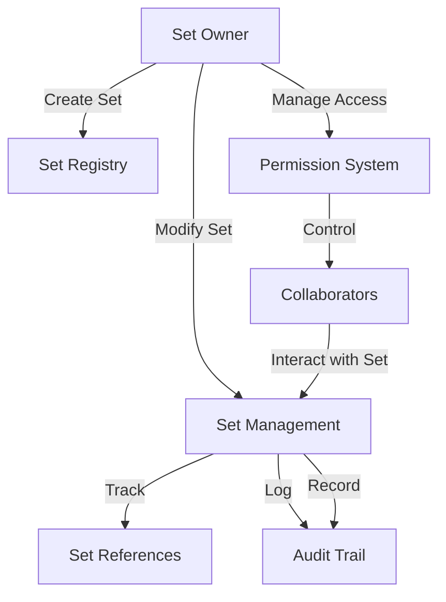

# DApp Set: Smart Contract Set Management

A decentralized set management system built on the Stacks blockchain, enabling developers and businesses to efficiently manage, track, and control sets of data with granular access and comprehensive logging.

## Overview

DApp Set provides a robust solution for managing complex data sets with secure, transparent, and traceable set operations. The system enables:

- Set registration on the blockchain
- Granular set management
- Comprehensive access control
- Detailed audit logging
- Versioned set tracking

## Architecture

The system is built around a single smart contract that manages set registrations, set operations, access permissions, and audit trails.



### Core Components

1. **Set Registry**: Stores set information and ownership
2. **Set Management**: Manages set operations and modifications
3. **Permission System**: Controls access rights
4. **Audit System**: Tracks all set interactions

## Contract Documentation

### Permission Levels

- `PERMISSION-NONE (u0)`: No access
- `PERMISSION-VIEW (u1)`: View-only access
- `PERMISSION-MODIFY (u2)`: Can modify set contents
- `PERMISSION-ADMIN (u3)`: Can manage permissions
- `PERMISSION-OWNER (u4)`: Full control

### Action Types

- `ACTION-CREATE (u1)`: Set creation
- `ACTION-VIEW (u2)`: Set access
- `ACTION-MODIFY (u3)`: Set modification
- `ACTION-SHARE (u4)`: Permission changes
- `ACTION-DELETE (u5)`: Set deletion

## Getting Started

### Prerequisites

- Clarinet
- Stacks wallet
- Node.js environment

### Basic Usage

1. Create a set:
```clarity
(contract-call? .set-manager create-set "set123" "Financial Data")
```

2. Add an element:
```clarity
(contract-call? .set-manager add-element 
    "set123" 
    0x1234... 
    "element-details")
```

3. Grant access:
```clarity
(contract-call? .set-manager grant-set-permission 
    "set123" 
    'ST1PQHQKV0RJXZFY1DGX8MNSNYVE3VGZJSRTPGZGM 
    u1)
```

## Function Reference

### Set Management

```clarity
(create-set (set-id (string-ascii 64)) (name (string-ascii 256)))
```
Creates a new set on the platform.

```clarity
(add-element 
    (set-id (string-ascii 64))
    (element (buff 32))
    (details (string-utf8 500)))
```
Adds a new element to a set.

### Access Control

```clarity
(grant-set-permission 
    (set-id (string-ascii 64))
    (user principal)
    (permission-level uint))
```
Grants access permissions to a user.

## Development

### Testing

1. Clone the repository
2. Install dependencies
3. Run tests:
```bash
clarinet test
```

### Local Development

1. Start Clarinet console:
```bash
clarinet console
```

2. Deploy contract:
```bash
clarinet deploy
```

## Security Considerations

### Access Control
- Only set owners can modify sets
- Permission levels are strictly enforced
- All access attempts are logged
- Set owners have full control

### Data Privacy
- Only set references are stored on-chain
- Access control is managed through permission levels
- Audit trail maintains accountability

### Limitations
- Limited to 64-character set IDs
- Permission changes require admin access